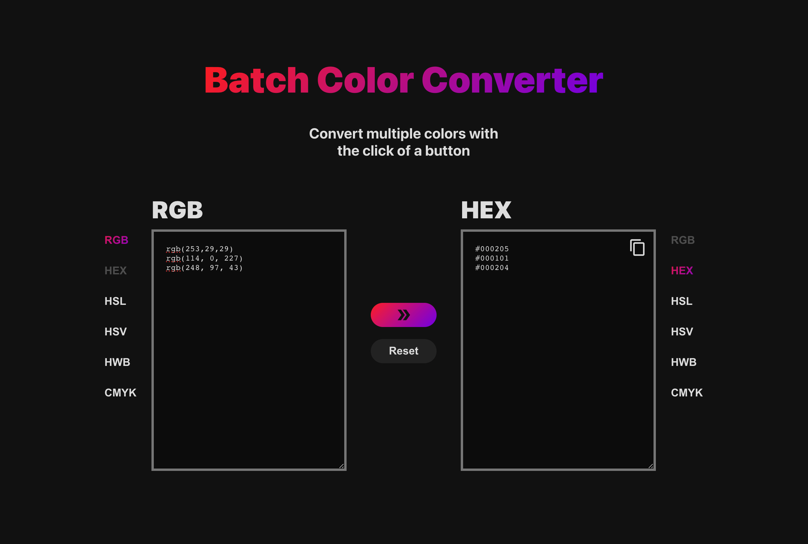

## Introduction

[Try it here](https://elina-codes.github.io/batch-color-converter/)

Convert multiple colors in batches.

Supports RGB, HEX, HSL, HSV, HWB, and CMYK formats.

## Tools

This app is built using React and TypeScript.
